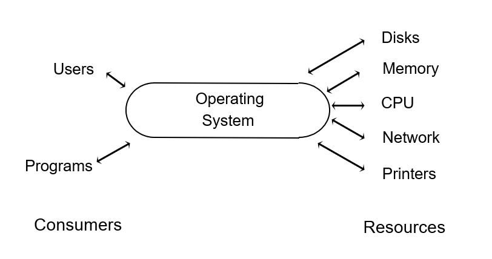
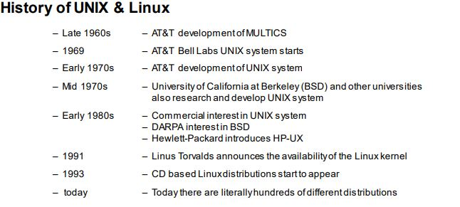
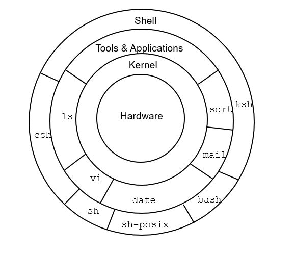
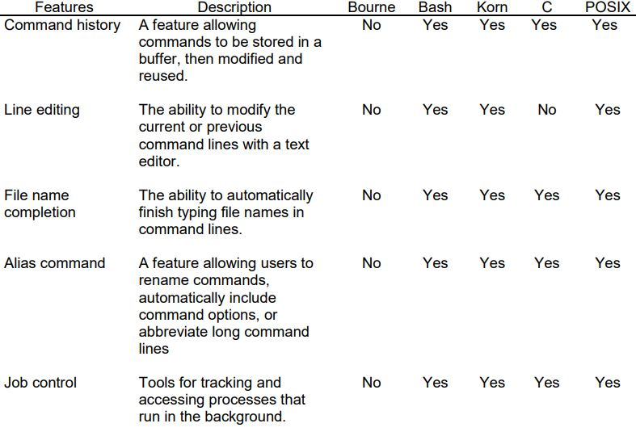
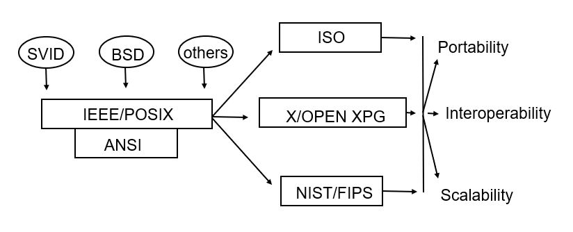

# What is Linux

Linux is a free implementation of a Unix like computer operating system.

## Free?
- Free as in you do not need to pay for it
```bash
    1- You may need to pay for the distribution
    2- You may need to pay for support
```
- Free as in you are free to do what you want with it
```bash
  (as long as you pass that freedom on)
```
> *Strictly speak Linux is just the Kernel. The rest of the environment associated with it started off as the GNU project and more formally the whole environment is known as GNU/Linux. Linux provides a free Unix like operating system. It is distributed under the terms of the GNU General Public License.*
>
> *Modern Linux distributions tend to include vast numbers of useful software tools, from the Unix like utilities which are the subject of this class through to environments such as Apache and Tomcat (Web & JSP Server), MySQL (an SQL Database), XEN & KVM Virtualization environments, Gnome & KDE desktops, Open Office office productivity software.*
>

# What is an Operating System ?

An operating system is a special computer program (software) that controls the computer (hardware). The operating system serves as a liaison between the consumers and the resources, often coordinating the allocation of limited resources among numerous
consumers. The resources include, for example, the CPU, disks, memory, and printers and the consumers are running programs requiring access to the resources. As an example, a user (or a program) requests to store a file on the disk, the operating system intervenes to manage the allocation of space on the disk, and the transfer of the information from memory to the disk



When a user requests program execution, the operating system must allocate space in memory to load and access the program. As the program executes, it is allowed access to the Central Processing Unit (CPU). In a time-sharing system, there are often several
programs trying to access the CPU at the same time.

The operating system controls how and when a program will have its turn in the CPU, similar to a policeman directing traffic in a complex intersection. The intersection is analogous to the CPU; there is only one available.Each road entering the intersection is like a program. Traffic from only one road can access the intersection at any one time, and the policeman specifies which road has access to the intersection, eventually giving all roads access through the intersection.

# History of UNIX & Linux

The UNIX operating system started at Bell Laboratories in 1969. Ken Thompson, supported by Rudd Canaday, Doug McIlroy, Joe Ossana, and Dennis Ritchie, wrote a small generalpurpose time-sharing system which started to attract attention. With a promise to provide good document preparation tools to the administrative staff at the Labs, the early developers obtained a larger computer and proceeded with the development.



In the mid 1970s the UNIX system was licensed to universities and gained a wide popularity in the academic community for the following reasons:

- It was small — early systems used a 512-kilobyte disk, using 16 kilobytes for the system, 8 KB for user programs, and 64 KB for files.
- It was flexible — the source was available, and it was written in a high-level language that promoted the portability of the operating system.
- It was cheap — universities were able to receive a UNIX system license basically for the price of a tape. Early versions of the UNIX system provided powerful capabilities that were available only in operating systems that were running on more expensive
hardware.

These advantages offset the disadvantages of the system at the time:

- It had no support — AT&T had spent enough resources on MULTICS and was not interested in pursuing the UNIX operating system.
- It was “buggy” — and since there was no support, there was no guarantee of bug fixes.
- It had little or no documentation, but you could always go to the source code

When the UNIX operating system reached the University of California at Berkeley, the Berkeley users created their own version of the system. Supported by the Department of Defense, they incorporated many new features. Berkeley, as a research institute, offered its licensees a support policy similar to AT&T's — none!

AT&T recognized the potential of the operating system and started licensing the system commercially. To enhance their product, they united internal UNIX system development that was being completed in different departments within AT&T, and also started to incorporate enhancements that Berkeley had developed.

**Later success can be attributed to:**
- A flexible user interface, and an operating environment that includes numerous utilities.
- The modularity of the system design that allows new utilities to be added.
- Capability to support multiple processes and multiple users concurrently.
- DARPA support at Berkeley.
- Availability of relatively powerful and cheap microcomputers.
- Availability of the UNIX system on a wide range of hardware platforms.
- Standardization of the interface definition to promote application portability

# Features of UNIX

The UNIX system provides a time-sharing operating system that controls the activities and resources of the computer, and an interactive, flexible operating interface. It was designed to run multiple processes concurrently and support multiple users to facilitate the sharing of data between members of a project team. The operating environment was designed with a modular architecture at all levels. When installing the UNIX system, you only need install the pieces that are relevant to your operating needs, and omit the excess. For example, the UNIX system supplies a large collection of program development utilities, but if you are not doing program development you need only to install the minimal compiler. The user interface also effectively supports the modular philosophy. Commands that know nothing about each other can be easily combined through pipelines, to perform quite complex
manipulations. 



## The Operating System 

The kernel is the operating system. It is responsible for managing the available resources and access to the hardware. The kernel contains modules for each hardware component that it interfaces with. These modules provide the functionality that allows programs access to the CPU, memory, disks, terminals, the network, and so forth. As new types of hardware are installed on the system, new modules can be incorporated into the kernel.

## The Operating Environment

### Tools and Applications

The modular design of the UNIX system environment is most evident in this layer. The UNIX system command philosophy is that each command does one thing well, and the collection of commands make up a tool box. When you have a job to complete you pull out
the appropriate tools. Complex tasks can be performed by combining the tools appropriately.From its inception, the UNIX system "toolbox" has included much more than just the basic commands required to interact with the system. The UNIX system also provides utilities for 

- electronic mail (mail, mutt)
- file editing (ed, ex, vi)
- text processing (sort, grep, wc, awk, sed)
- text formatting (nroff)
- program development (cc, make, lint, lex)
- program management (SCCS, RCS)
- inter-system communications (uucp)
- process and user accounting (ps, du, acctcom)

Since the UNIX system user environment was designed with an interactive, programmable,modular implementation, new utilities can easily be developed and added to the user's toolbox, and unnecessary tools can be omitted without impairing system operation.

As an example, an application programmer and a technical writer are using UNIX systems. They will use many common commands, even though their applications are very different. They will also use utilities that are appropriate just for their development. The application programmer's system will include utilities for program development and program management, while the technical writer's system will contain utilities for text formatting and processing, and document management. It is interesting to note that the utility that the application developer uses for program revision control can also be used by the technical writer for document revision control. Therefore, their systems will look very similar, yet each user has selected and discarded the modules that are relevant to his or her application needs.

** The popularity of the UNIX system can largely be attributed to **

- The completeness and the flexibility of the UNIX system allowing it to fit into many application environments.
- The numerous utilities that are included in the operating environment enhancing users' productivity.
- The availability on and portability to many hardware platforms.

### The Shell
The shell is an interactive command interpreter. Commands are entered at the shell prompt,and acted upon as they are issued. A user communicates with the computer through the shell. The shell gathers the input the user enters at the keyboard and translates the command into a form that the kernel can understand. Then the system will execute the command.

You should notice that the shell is separate from the kernel. If you do not like the interface provided by the supplied shell, you can easily replace it with another shell. Many shells are currently available. Some are command driven and some provide a menu interface. The common shells that are supplied with the UNIX & Linux systems include both a command interpreter and a programmable interface.

There are two main families of shells that are commonly available in the UNIX system
environment. They are

- Bourne Shell — the original shell provided on AT&T based systems developed by Stephen Bourne at Bell Laboratories. It provides a UNIX system command interpreter and supports a programmable interface to develop shell programs, or scripts as they are commonly called. The programmable and interactive interfaces provide capabilities such as variable definition and substitution, variable and file testing, branching, and loops.

- C Shell (/usr/bin/csh) — the shell developed at the University of California Berkeley by Bill Joy, and is provided on BSD-based systems. This shell was referred to as the California Shell, which was shortened to just the C Shell. It was considered an
improvement over the Bourne Shell because it offered interactive features such as a command stack which allows simple recalling and editing of previously entered commands, and aliasing which provides personalized alternative names for existing commands.

From these two bases many shells have evolved. The Bourne Shell was significantly enhanced at Bell Labs by David Korn to derive the “ksh” which later formed the basis of the POSIX standard for the shell. While modern Linux systems may ship with a large number of different shells and many more are available for download should anyone be interested. The most commonly used shell in the Linux world has become “BASH” The Borne Again Shell. This is compliant with the POSIX standard but provides many additional features, including some of the popular ones from the csh.

*** Comparison of Shell Features ***



# More Features of UNIX
-  Hierarchical file system
-  Multi-tasking
-  Multi-user

## Hierarchical File System
Information is stored on the disk in containers known as files. Every file is assigned a name,and a user accesses a file by referencing its name. Files normally contain data, text, programs, and so on. A UNIX system normally contains hundreds of files, so another container, the directory, is provided that allows users to organize their files into logical groupings. In the UNIX system, a directory can be used to store files or other directories.

The file system structure is very flexible, so if a user's organizational needs change, files and directories can be easily moved, renamed, or grouped into new or different directories through simple UNIX system commands. The file system, therefore, is like an electronic filing cabinet. It allows users to separate and organize their information into directories that are most appropriate for their environment and application.

## Multitasking
In the UNIX system several tasks can be performed at the same time. From a single terminal, a single user can execute several programs that all seem to be running simultaneously. This means that a user can edit a text file, while another file is being
formatted, while yet another file is being printed.

In actuality, the CPU can execute only one task at a time, but the UNIX operating system has the capability to time-share the CPU between multiple processes that are scheduled to run at the same time. So, to the user, it appears that all programs are executing
simultaneously.

## Multiuser
Multi-user capability allows more than one user to log in and use the system at the same time. Multiple terminals and keyboards can be attached to the same computer. This is a natural extension of the multi-tasking capability. If the system can run multiple programs simultaneously, some of those multiple programs should be able to support other user sessions. In addition, a single user could log in multiple times to the same system through multiple terminals. A big advantage of this architecture is that members of a work group can have access to the same data at the same time, either from a development or a user viewpoint.

# The UNIX System and Standards

The UNIX system was developed with a focus on portability.Since most of the operating system and utilities have been written in C (as opposed to assembler), the UNIX system has not been restricted to one processor or hardware platform. On the other hand, since the UNIX system is written in a high level language, it is easy to modify, as exemplified by the over 100 companies that offer UNIX-based implementations (licensed from The Open Group) and the UNIX system clones (new implementations of a UNIX-like interface that do not require an Open Group license). Even though most systems are derived from AT&T UNIX, BSD UNIX, or a combination of both,each implementation may incorporate unique extensions to the operating system, such as real time capabilities, that may negate the compatibility between different UNIX system implementations. (Actually, System V has already incorporated many of the popular features of BSD.) To encourage consistency from implementation to implementation standards are being formulated for the UNIX system operating environment. 



The goal of these standards is to promote the following:

1. Portability — the ability to easily transfer an application from one UNIX system implementation to another.
2. Interoperability — the ability for applications running on different UNIX system implementations to share information.
3. Scalability — provide a range of hardware options, from small systems to large systems, users can select from depending on their application needs. Plus allow flexible system upgrade capabilities as application needs grow.

Despite the many implementations of the UNIX system, the differences at the user level are slight, since most have been developed from common origins. Therefore, the standards initially focused on the source code interface to the kernel, and are only recently evaluating standardization of the interactive user interface.

## Goals of the Standards Bodies

### Define Interface Not Implementation
Standards are not intended to define a totally new interface but to create a well-defined,portable interface based on current UNIX system implementations. It is important to understand that standards are intended to define interfaces to the UNIX system operating environment, not how a standard is to be implemented. Therefore, the UNIX system standards do not dictate that all UNIX system computers be complete duplicates, rather that they will all support a common set of functions that specific implementations can be formed around.

A good analogy would be an automobile. The basic interface defined by the automobile "standard" is
    Go — step on accelerator
    Stop — step on brake
    Change directions — turn wheel
    Start engine — turn key

Automobiles that support these standard interfaces can be designed with many different implementations. For example, the automobile could have an electric engine or a gas engine, but stepping on the accelerator would make either go.

An interesting side effect of this philosophy is that it will be possible for non-UNIX operating systems to comply with the defined standards by supporting the prescribed interfaces.
### Modularity
The computing environment is continually changing and growing. The standards should be extensible. They should be able to keep up with advances in technology and user  demands.

Standards are being defined in a modular fashion so that they can be added to, or possibly replaced, when a better interface emerges.

## AT&T System V Interface Definition (SVID)
AT&T was the first to develop a standard in the UNIX system operating environment. Their standard, based on AT&T's System V, focuses on the function level interface to the operating system (system calls), interprocess communications, the UNIX system shell and some basic utilities.

AT&T also developed the System V Verification Suite (SVVS) to verify SVID compliance.

Although the SVID was the first attempt to develop a standard, the standard was not vendorneutral, since AT&T was the definitive body. For example, at System V Release 3 (System V.3), AT&T enforced such strict qualifications for implementations that desired System V.3 endorsement, that certain Berkeley extensions would negate System V.3 compliance.

## IEEE/POSIX
The Institute of Electrical and Electronics Engineers (IEEE) sponsors the Portable Operating System Interface for computer environments (POSIX). POSIX originated from the 1984 /usr/group Standard, whose goal was to define standards beyond the SVID (/usr/group is the predecessor to UniForum). POSIX 1003 was set up to develop standards for the complete operating environment, not just the kernel interface. Unlike AT&T, POSIX defines a programming interface without defining the implementation. Therefore, POSIX-compliant systems can be developed that are not derived from AT&T code.

POSIX has also been submitted to the ISO for inclusion in the international standard. It is associated with the draft proposed standard TC22 WG15.

To advance the standard development, POSIX has been partitioned into several components, and a working group assigned to each.

Component   | Component Description 
------------|---------------------------------------------------------------------------------------------------------------------
1003.1      | System Interface (formed 1981).
            | Provides a source code, programmatic interface bound to a high level language that facilitates application 
            | portability. POSIX.1 is closely related to SVID Issue 2 (SVID2), but also includes features from BSD 4.3 and 
            | additional features that are not supplied with either interface definition.
1003.2      | Shells and Utilities (formed 1984).
            | Defines a shell command language and interactive utilities.
1003.3      | Testing Methods (formed 1986).
            | Defines the general requirements for how test suites should be written and administered. Provides a list of test 
            | assertions showing exactly what in the POSIX standard has to be tested. This work group will not be authoring the 
            | test suites, and the method of testing is left up to the vendor.
1003.4      | Real Time
            |  4a Thread Extensions
            |  4b Language Independent Specification
1003.5      | Ada Binding for POSIX
## X/Open and The Open Group

X/Open has been an international consortium of information system suppliers, users, system integrators and software developers who joined to define a Common Application Environment. Their mission was not to define new standards, but select from existing
standards those that will ensure portability and interworking of applications, and allow users to move between systems without additional training. X/Open also has its origins from SVID, but is a superset of POSIX. X/Open's Portability Guide (XPG, currently revision 4) includes a set of relevant standards that address the entire application environment. 

X/Open has recently merged with the Open Software Foundation (OSF) to form The Open Group.

*Some elements include the following:*


## American National Standards Institute (ANSI)

The coordinating organization for voluntary standards in the USA. IEEE is an accredited standards committee of ANSI.

## International Standards Organization (ISO)
Coordinates the adoption of international standards for distributed information systems in an open systems environment (an environment of heterogeneous networked systems). Most notable developments have been in the area of networking and the definition of the seven blayer Open Systems Interconnection (OSI) network reference model.

The ISO participants generally come from national standards organizations of the member countries. In the USA, ANSI is an ISO participant.

## National Institute of Standards and Technology Federal Information Processing Standard (NIST/FIPS)
The NIST was formerly the National Bureau of Standards (NBS) and is under the direction of the Department of Commerce. This organization is developing standards requirements for governmental agencies. Their original mission was to evaluate the proposed  POSIX.1 standards, and the resulting Federal Information Processing Standard (FIPS) incorporated POSIX plus additional features that POSIX.1 considered optional or did not specify

## Linux Standards

A variety of standards bodies have recently been created to oversee the development of the Linux operating system and associated utilities.

Details can be found at the following URLs:
- http://www.redhat.com/
- http://www.gnu.org/
- http://www.linux.org/


## WHY SHOULD YOU LEARN ABOUT LINUX?

Linux is a critical technology for IT professionals to understand.

Linux is in widespread use, and if you use the internet at all, you are probably already interacting with Linux systems in your daily life. Perhaps the most obvious way in which you interact with Linux systems is through browsing the World Wide Web and using e-commerce sites to buy and sell products.

However, Linux is in use for much more than that. Linux manages point-of-sale systems and the world's stock markets, and also powers smart TVs and in-flight entertainment systems. It powers most of the top 500 supercomputers in the world. Linux provides the foundational technologies powering the cloud revolution and the tools used to build the next generation of container-based microservices applications, software-based storage technologies, and big data solutions.

In the modern data center, Linux and Microsoft Windows are the major players, and Linux is a growing segment in that space. Some of the many reasons to learn Linux include:
* A Windows user needs to interoperate with Linux.
* In application development, Linux hosts the application or its runtime.
* In cloud computing, the cloud instances in the private or public cloud environment use Linux as the operating system.
* With mobile applications or the Internet of Things (IoT), the chances are high that the operating system of your device uses Linux.
* If you are looking for new opportunities in IT, Linux skills are in high demand.